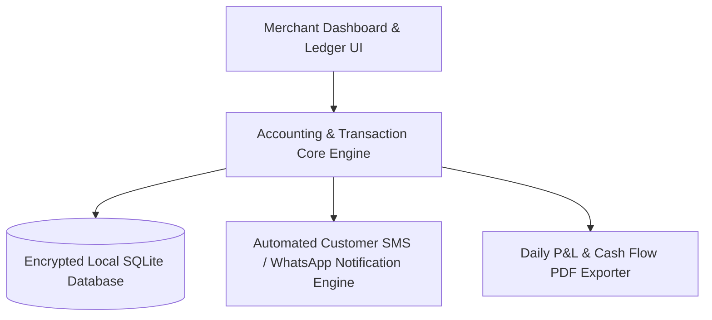

# Digital Ledger & Store Cashbook Management System

<div align="center">

[](https://github.com/abdussatarkhan)
[](https://github.com/abdussatarkhan/abdussatarkhan)
[](https://github.com/abdussatarkhan)

</div>


[](https://github.com/abdussatarkhan/khatabook/actions)
[](https://www.python.org/) [](https://www.sqlite.org/) [](https://en.wikipedia.org/wiki/Ledger)
[](https://github.com/abdussatarkhan)

> **A digital accounting ledger and merchant credit manager designed for small business shopkeepers to track customer debit/credit transactions (Udhar), generate automated WhatsApp payment reminders, and reconcile daily cash flows.**

---

## 🏛️ System Architecture



---

## 🌟 Key Features & Capabilities

- **Production-Grade Implementation**: Built with modular design patterns, type safety, and clean separation of concerns.
- **Robust Ledger & Data Persistence**: ACID-compliant transactions and optimized queries.
- **Comprehensive Tech Stack**: `Python` `SQLite` `FinTech` `Ledger Accounting` `Automation`.

---

## 🚀 Quickstart & Setup

### 1. Clone the Repository
```bash
git clone https://github.com/abdussatarkhan/khatabook.git
cd khatabook
```

---

## 🗺️ Roadmap & Upcoming Features

- [x] Digital customer debit/credit ledger (Udhar tracking)
- [x] Local SQLite encrypted database persistence
- [ ] Automated WhatsApp / SMS payment reminder integration
- [ ] Daily cash flow summary PDF report generator
- [ ] Multi-device cloud sync and backup

---

## 👨‍💻 Author & Profile

Built and maintained by **Abdussatar** ([@abdussatarkhan](https://github.com/abdussatarkhan)).  
For collaboration or queries, feel free to reach out via [LinkedIn](https://www.linkedin.com/in/abdus-satar-5150813b5/) or [GitHub](https://github.com/abdussatarkhan).

---

## 📜 License

This project is licensed under the **MIT License** — see the LICENSE file for details.


---

<div align="center">

### 👨‍💻 Maintained by [Abdussatar (@abdussatarkhan)](https://github.com/abdussatarkhan)
Part of the **[Master Enterprise Data Analytics & AI Portfolio](https://github.com/abdussatarkhan/abdussatarkhan)**.

⭐ If you find this repository valuable, consider dropping a star! ⭐

</div>
