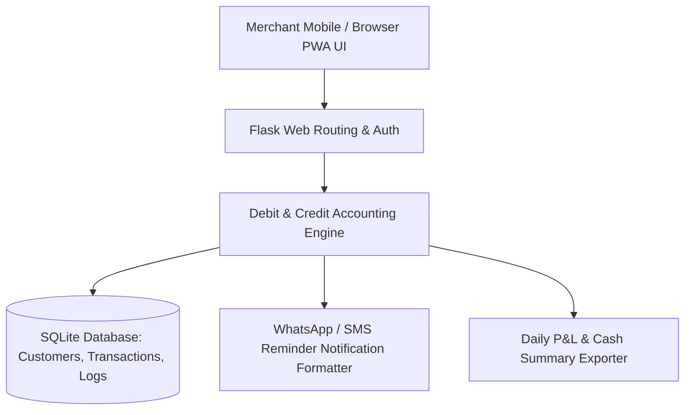
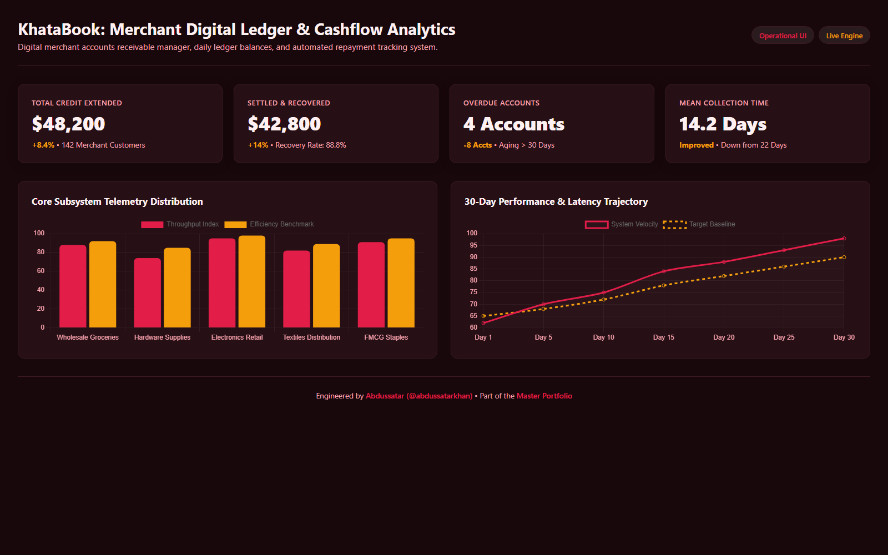

# KhataBook — Digital Ledger & Merchant Cashbook Application

<div align="center">

[](https://github.com/abdussatarkhan)
[](https://github.com/abdussatarkhan)
[](https://github.com/abdussatarkhan)

</div>

[](https://github.com/abdussatarkhan/khatabook/actions)
[](https://www.python.org/)
[](https://flask.palletsprojects.com/)
[](https://www.sqlite.org/)
[](https://web.dev/progressive-web-apps/)

> **A mobile-first digital accounting ledger and customer credit manager designed for small business shopkeepers built with Python Flask and SQLite, featuring Progressive Web App (PWA) offline capabilities — managing customer debit/credit transactions (Udhar), automated balance reminders, and daily cash flow reconciliation.**

---

## 🏛️ System Architecture



---

## 🌟 Key Features & Capabilities

- **📒 Digital Udhar & Credit Ledger**: Replaces traditional manual paper registers with an organized digital debit/credit ledger for each customer and supplier.
- **💵 Real-Time Cash Flow Reconciliation**: Instantly computes total amount receivable (You'll Receive / Lene Hain) vs amount payable (You'll Give / Dene Hain) with net daily cash balances.
- **📱 Progressive Web App (PWA) Enabled**: Includes `sw.js` service worker and `manifest.json` for installable mobile home-screen access and offline asset caching.
- **📩 Automated Payment Reminders**: Generates pre-formatted WhatsApp and SMS reminder links containing exact due balances and payment details.

---

## 🚀 Quickstart & Setup

### Prerequisites
- [Python 3.10+](https://www.python.org/downloads/)

### 1. Clone the Repository
```bash
git clone https://github.com/abdussatarkhan/khatabook.git
cd khatabook
```

### 2. Environment Setup & Run
```bash
# Create and activate virtual environment
python -m venv venv
source venv/bin/activate  # On Windows: .\venv\Scripts\activate

# Install dependencies
pip install -r requirements.txt

# Run the Flask application
python app.py
```

Open your browser and navigate to:
`http://localhost:5000`

---

## 🖥️ Application & Operational Interface

<p align="center">
  
</p>

> [!TIP]
> You can also explore [`dashboard.html`](dashboard.html) directly in any modern browser for a standalone interface walkthrough.

---

## 🗺️ Roadmap & Upcoming Enhancements

- [x] Customer debit/credit tracking with balance calculations
- [x] PWA offline caching with service workers
- [x] WhatsApp payment reminder link generator
- [ ] Automated daily transaction PDF report export
- [ ] Multi-store multi-user cashier permission levels
- [ ] Cloud backup and multi-device database synchronization

---

## 👨‍💻 Author & Contact

Built and maintained by **Abdussatar** ([@abdussatarkhan](https://github.com/abdussatarkhan)).  
For technical discussions, collaboration, or queries, feel free to reach out via [LinkedIn](https://www.linkedin.com/in/abdus-satar-5150813b5/) or [GitHub](https://github.com/abdussatarkhan).

---

## 📜 License

This project is licensed under the **MIT License** — see the LICENSE file for details.

---

<div align="center">

### 👨‍💻 Maintained by [Abdussatar (@abdussatarkhan)](https://github.com/abdussatarkhan)
Part of the **[Abdussatar Software Engineering & Systems Portfolio](https://github.com/abdussatarkhan)**.

⭐ If you find this project valuable, consider dropping a star! ⭐

</div>
